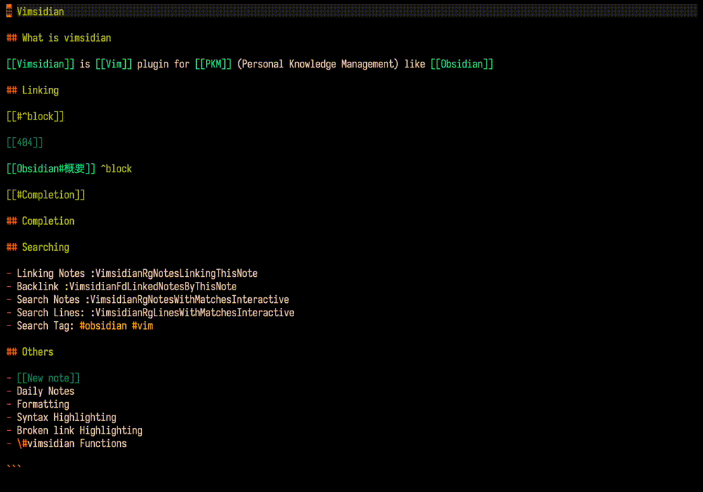

# vimsidian

Vim plugin to help edit [Obsidian](https://obsidian.md/) notes in Vim. Highlight, Complement, Searching and open links and tags. Even if you don't use [Obsidian](https://obsidian.md/), you can use it to manage your notes locally.

This plugin was made for me, but I hope it will be useful for those who want to easily edit [Obsidian](https://obsidian.md/) notes with vim as I do. If you have trouble using it, please post an [issues](https://github.com/kis9a/vimsidian/issues) below. Contributions, edits and distribution are also welcome. I also shared on the obsdiain forum. [forum.obsidian.md - 46385](https://forum.obsidian.md/t/vimsidian-vim-plugin-to-help-edit-obsidian-notes-in-vim/46385)

<span style="margin: 26px 52px"></span>

## Motivation

In my earlier days, I used to divide notes in directories and manage note relationships by describing relative paths.

However, I had trouble categorizing notes and spent a lot of time resolving note paths. I needed to achieve the following

- Hierarchical structure is not suitable for classification of detailed personal knowledge.
- Create atomic notes and link notes to each other.
- Eliminate stress by unifying editing tasks and management of editing plug-ins in Vim.
- [[Link]] format to integrate into [Obsidian](https://obsidian.md/).

For me, [vimsidian](https://github.com/kis9a/vimsidian) is the plugin that solves these issues and complements my PKM (personal knowledge managment).

## Features

- Provide a completion function for note entry
- Find and move the link under the cursor
- Go to link before or afater current cursor
- Create a note with the name of the link under the cursor
- Search for notes and lines matching keywords
- Display notes in the quickfix window containing the tag string under the cursor
- Default syntax highlighting settings
- Custom formatting of link spacing

## Initialization

### Requirements

- `VIMSIDIAN_PATH` environment variable
- [ripgrep](https://github.com/BurntSushi/ripgrep) command
- [fd](https://github.com/sharkdp/fd) command

### Installation

Use your favorite plugin manager

- Example: [vim-plug](https://github.com/junegunn/vim-plug)

```vim
Plug "kis9a/vimsidian"
```

## Configuration

#### • Minimal

```vim
let g:loaded_vimsidian_plugin = 0
let g:vimsidian_enable_syntax_highlight = 1
let g:vimsidian_enable_complete_functions = 1
let g:vimsidian_complete_paths = [$VIMSIDIAN_PATH . "/notes", $VIMSIDIAN_PATH . "/images"]

function! s:vimsidianNewNoteAtNotesDirectory()
  execute ":VimsidianNewNote " . $VIMSIDIAN_PATH . "/notes"
endfunction

function s:vimsidianMappings()
  nnoremap <silent> sl :VimsidianFdLinkedNotesByThisNote<CR>
  nnoremap <silent> sg :VimsidianRgNotesLinkingThisNote<CR>
  nnoremap <silent> st :VimsidianRgTagMatches<CR>
  nnoremap <silent> sm :VimsidianRgNotesWithMatchesInteractive<CR>
  nnoremap <silent> si :VimsidianRgLinesWithMatchesInteractive<CR>
  nnoremap <silent> sF :VimsidianMoveToLink<CR>
  nnoremap <silent> sk :VimsidianMoveToPreviousLink<CR>
  nnoremap <silent> sj :VimsidianMoveToNextLink<CR>
  nnoremap <silent> sN :call <SID>vimsidianNewNoteAtNotesDirectory()<CR>
  nnoremap <silent> sf :VimsidianFormatLink<CR>
endfunction

autocmd BufNewFile,BufReadPost $VIMSIDIAN_PATH/*.md call s:vimsidianMappings()
```

#### • Advance, ideas

<!--{{{ Define the colors yourself -->
<details close>
<summary>Define the colors yourself</summary>
<br/>

```vim
let g:vimsidian_color_definition_use_default = 0

hi! def VimsidianLinkColor term=NONE ctermfg=47 guifg=#689d6a
hi! def VimsidianLinkMediaColor term=NONE ctermfg=142 guifg=#b8bb26
hi! def VimsidianLinkHeader term=NONE ctermfg=142 guifg=#b8bb26
hi! def VimsidianLinkBlock term=NONE ctermfg=142 guifg=#b8bb26
hi! def VimsidianTagColor term=NONE ctermfg=109 guifg=#076678
hi! def VimsidianPromptColor term=NONE ctermfg=109 guifg=#076678
```

</details>
<!--}}}-->

<!--{{{ Disable required commands checks to make plugins load a bit faster -->
<details close>
<summary>Disable required commands checks to make plugins load a bit faster</summary>
<br/>

```vim
" It is assumed that the following commands are already installed
" :echo g:vimsidian_required_commands
let g:vimsidian_check_required_commands_executable = 0
```

</details>
<!--}}}-->

<!--{{{ Refine complete_paths to speed up search for completions -->
<details close>
<summary>Refine complete_paths to speed up search for completions</summary>
<br/>

```vim
" vimsidian complete paths search use ls command
let g:vimsidian_complete_paths_search_use_fd = 0
let g:vimsidian_complete_paths = [$VIMSIDIAN_PATH . "/notes/foo", $VIMSIDIAN_PATH . "/notes/b"]
```

</details>
<!--}}}-->

<!--{{{ Create new note same directory as current file -->
<details close>
<summary>Create new note same directory as current file</summary>
<br/>

```vim
function! s:vimsidianNewNoteSameDirectoryAsCurrentFile()
  execute ':VimsidianNewNote ' . fnamemodify(expand("%:p"), ":h")
endfunction

autocmd BufNewFile,BufReadPost $VIMSIDIAN_PATH/\*.md nnoremap <silent> sC :call <SID>vimsidianNewNoteSameDirectoryAsCurrentFile()<CR>
```

</details>
<!--}}}-->

<!--{{{ Get link name under cursor -->
<details close>
<summary>Get link name under cursor</summary>
<br/>

```vim
function! s:getCurrentCursorLink()
  let link = vimsidian#unit#CursorLink()
  echo "Link name under cursor '" . link . "'"
endfunction
```

</details>
<!--}}}-->

## Help

- [Vim doc - Syntax highlight, Variables and Commands help](./doc/vimsidian.txt)

```vim
" Run some Vimsidian command to load
:h vimsidian
```

## LICENSE

- [WTFPL license - Do What The F\*ck You Want To Public License](./LICENSE.md)
