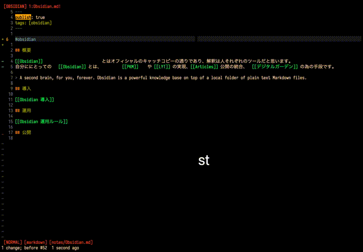

# vimsidian

Vim script to help edit obsidian notes in Vim. Highlight, Complement, Searching and open links and tags.

## Required

- `realpath` command
- <https://github.com/BurntSushi/ripgrep>
- <https://github.com/sharkdp/fd>
- Customize obsidian path variables, highlight color, mappings for you.

## Source

### Syntax Highlight

- link `\v\[\[.{-}\]\]`
- link media `\v\!\[\[.{-}\]\]`
- link heading `\v\[\[#.{-}\]\]`
- link block `\v\[\[#.{-}\]\]`
- tag `\v\#(\w+)`

### Functions

- CompleteObsidianFiles(findstart, base)

  List of notes under `$obsidian_complete_paths` are popped up and input is completed. press `keyword<C-X><C-U>` in insert mode.

- ObsidianRgNotesWithMatches(word)

  Search `$obsidian_path` for a list of notes containing the argument word and display it in the quickfix list.

- ObsidianRgTagMatches()

  Search `$obsidian_path` for list of matches containing the under cursor tag name and display it in the quickfix list.

- ObsidianFdLinkedNotesByThisNote()

  Search `$obsidian_path` for list of notes linked to by this note and display it in the quickfix list.

- ObsidianRgNotesLinkingThisNote()

  Search `$obsidian_path` for list of notes linking this note and display it in the quickfix list.

- ObsidianMoveToLink()

  Search `$obsidian_path` for the link you are cursor on and move it.

- ObsidianFormatLink()

  Format obsidian link string for the current file. See pattern [test_obsidian_format_link](./docs/test_obsidian_format_link).
